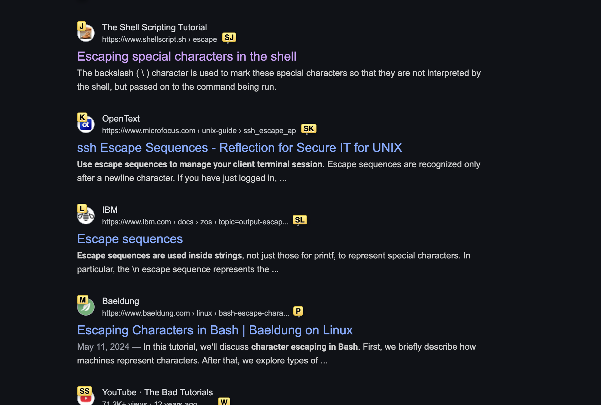

# keypress interface

The Vimium Chrome extension allows users to press a keyboard key and have a bunch of options come up for what key combination they can press to click a particular clickable on screen.

My objective is to somewhat replicate this program's functionality in the terminal, with a person's todos. They need to be able to scroll down. I can at least render the first 20 or so to start. Let's say someone has 20 tasks. I want to see if I can render out multiple rows of tasks
